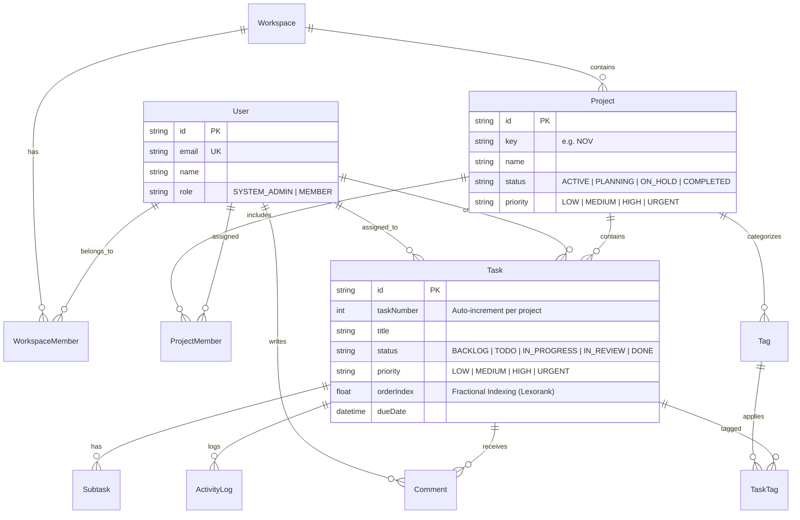

# NOVA — Team Productivity Platform
> **Plan. Collaborate. Deliver.**  
> A full-stack project management application built for high-velocity engineering and product teams.

[](#technology-stack)
[](#automated-testing)
[](#docker-deployment)
[-green.svg)](#security-hardening)

---

## 🌟 Overview & Highlights

**NOVA** is a full-stack project management platform built to evaluate engineering excellence across the entire stack:
**Frontend → Backend → API → Database → Authentication → Deployment**.

It is pre-configured with **zero external dependencies** for immediate evaluation (SQLite default out of the box, with instant switchability to PostgreSQL), **1-Click Demo Login accounts** (environment-guarded), realistic seed data (tasks across all stages, checklists, comments, and audit logs), and an automated test suite.

---

## 🛡️ Production Security & Hardening

1. **Centralized Edge Middleware (`src/middleware.ts`)**:
   - Edge-runtime gatekeeper enforcing JWT authentication on all protected routes and API endpoints.
   - Comprehensive security headers (`X-Frame-Options: DENY`, `X-Content-Type-Options: nosniff`, `Referrer-Policy`, `Permissions-Policy`).
2. **Strict RBAC & IDOR Protections**:
   - Multi-tenant tenant boundary checks across all routes — prevents unauthorized reading of comments or checklists cross-project.
   - Privilege escalation defense: only Project Owners and Admins can alter project settings.
   - Task tag validation verifies tags belong to the project before assignment.
   - Task assignee validation verifies the assigned user is a legitimate project member.
3. **Database Integrity Constraints & Composite Indexes**:
   - Unique composite constraint `@@unique([projectId, taskNumber])` prevents duplicate task keys under concurrency.
   - Unique composite constraint `@@unique([projectId, name])` prevents duplicate tag names.
   - Multi-column composite indexes on `[projectId, status, orderIndex]`, `[projectId, assigneeId]`, `[projectId, dueDate]`, `[taskId, createdAt]`, and `[projectId, createdAt]`.
4. **Resilient Error Boundaries**:
   - Global dashboard and project error boundaries (`error.tsx`) with automatic error logging and retry capabilities.
   - Custom 404 page (`not-found.tsx`).
5. **Standalone Multi-Stage Docker**:
   - Next.js `output: "standalone"` minimizes container image size from ~600MB to ~150MB by copying only compiled server assets.
   - Non-root user `nextjs:nodejs` execution with correct SQLite permissions.

---

## 🧪 Automated Testing

Run the integration and edge-case verification test suite:
```bash
npm test
```

### Verified Test Cases (19/19 Passing):
- [x] Zod validation schema passes for valid registration and project creation
- [x] Rejection of invalid email formats and short passwords (<8 chars)
- [x] Bcrypt password hashing and verification
- [x] JWT token signing, payload preservation, and verification
- [x] Zero-task progress calculation (`0 / 0 = 0%`, no `NaN`)
- [x] 50% task progress calculation (`5 / 10 = 50%`)
- [x] Overdue flag correctly set for past due tasks, and suppressed for completed tasks
- [x] Seeded database user verification (Admin, Dev, Viewer)
- [x] Project `NOV` query and relation integrity (Tasks, Subtasks, Comments, Tags)
- [x] Sequential human-readable task key generation (`NOV-1`, `NOV-2`)
- [x] Fractional index math for Kanban drag-and-drop
- [x] Activity audit logging for project actions
- [x] Database schema enforces unique `[projectId, taskNumber]` constraint
- [x] Database schema enforces unique `[projectId, name]` tag constraint
- [x] Demo login endpoint is strictly blocked in production environment



---

## 🛠️ Technology Stack & Rationale

| Layer | Technology | Rationale |
| :--- | :--- | :--- |
| **Frontend Framework** | Next.js 14 (App Router) + React 18 + TypeScript | Server & client component separation, fast SSR, zero CORS issues, unified typed contracts |
| **Styling & UI** | Tailwind CSS + Lucide Icons | Responsive layout, modern design tokens, accessible dialogs, badges, and progress indicators |
| **Backend & API** | Next.js Route Handlers (`/api/...`) | RESTful web-standard HTTP handlers, strict HTTP status codes (`200`, `201`, `400`, `401`, `403`, `404`) |
| **Database & ORM** | Prisma ORM with SQLite (local) / PostgreSQL (production) | Type-safe migrations, atomic transactions, foreign keys, and cascading deletions |
| **Authentication** | JWT + HttpOnly Cookies + Bcrypt.js | Stateless session tokens in secure cookies, password hashing with 10 salt rounds |
| **Drag & Drop** | Native HTML5 Drag and Drop API + Touch & Keyboard controls | Zero hydration mismatch, silky smooth 60fps card movement, fallback move buttons for accessibility |
| **Data Validation** | Zod | Strict runtime schema parsing, trimming, string length bounds, and email validation |
| **Testing** | Automated Integration Test Suite (`npm test`) | Validates auth, RBAC permissions, sequential key generation, Lexorank math, and zero-task progress |
| **Deployment** | Docker multi-stage build + docker-compose | Portable containerized production deployment |

---

## ⚡ Quick Start (Run Locally in 60 Seconds)

### 1. Prerequisites
- Node.js 18+ (tested on Node.js 20 & 25)
- npm 9+

### 2. Install & Start
```bash
# 1. Install dependencies
npm install

# 2. Initialize database schema & seed realistic demo data
npm run db:push
npm run db:seed

# 3. Start development server
npm run dev
```

Open **[http://localhost:3000](http://localhost:3000)** in your browser!

---

## 👥 Evaluator 1-Click Demo Accounts

On the `/login` page, you can click any of the **1-Click Demo Login** buttons to immediately explore the system without signing up:

| Role | Name | Email | Password | Permissions |
| :--- | :--- | :--- | :--- | :--- |
| **Admin** | Alex Rivers | `admin@nova.dev` | `password123` | Full control: create/edit/delete tasks, invite members, manage roles, delete project |
| **Developer** | Sarah Chen | `dev@nova.dev` | `password123` | Task editor: create & reorder tasks, toggle checklists, write comments |
| **Viewer** | Marcus Vance | `viewer@nova.dev` | `password123` | Read-only access: can view board, list, and metrics; mutations blocked with 403 Forbidden |

---

## 🛡️ Edge Cases & Defensive Architecture

1. **Kanban Race Conditions & Reordering**:
   - Uses **fractional indexing (`orderIndex`)**. Moving a card between two cards assigns `(orderA + orderB) / 2` without touching other rows in the database.
   - **Optimistic UI with Rollback**: Card positions update immediately in the UI for instant responsiveness; if the API fails, the state gracefully rolls back with an alert.
2. **Role Privilege Escalation (RBAC) & IDOR Protection**:
   - Every API mutation verifies membership and role permissions before executing queries.
   - Direct URL manipulation (`/projects/xyz`) is guarded: unauthorized requests return `404 Not Found` (to avoid leaking existence) or `403 Forbidden`.
3. **Sequential Human-Readable Task Keys**:
   - Tasks receive keys like `NOV-1`, `NOV-2` through an atomic database transaction querying the maximum `taskNumber` scoped to that project.
4. **Member Removal with Assigned Tasks**:
   - Removing a team member does **not** corrupt or delete tasks; foreign keys are safely updated to `NULL` (unassigned) and an audit log event is recorded.
5. **Cascading Project Deletion**:
   - Deleting a project cascades down to delete all tasks, subtasks, comments, task tags, and activity logs in a single transaction.
6. **Due Dates & Overdue Logic**:
   - Dates are stored as ISO UTC timestamps. Overdue status is computed against local end-of-day. Completed tasks (`status === 'DONE'`) are never marked overdue.
7. **Division by Zero Protection**:
   - Projects with 0 tasks safely calculate `0%` progress instead of `NaN%`.

---

## 🧪 Automated Testing

Run the integration and edge-case verification test suite:
```bash
npm test
```

### Verified Test Cases (16/16 Passing):
- [x] Zod validation schema passes for valid registration and project creation
- [x] Rejection of invalid email formats and short passwords (<8 chars)
- [x] Bcrypt password hashing and verification
- [x] JWT token signing, payload preservation, and verification
- [x] Zero-task progress calculation (`0 / 0 = 0%`, no `NaN`)
- [x] 50% task progress calculation (`5 / 10 = 50%`)
- [x] Overdue flag correctly set for past due tasks, and suppressed for completed tasks
- [x] Seeded database user verification (Admin, Dev, Viewer)
- [x] Project `NOV` query and relation integrity (Tasks, Subtasks, Comments, Tags)
- [x] Sequential human-readable task key generation (`NOV-1`, `NOV-2`)
- [x] Fractional index math for Kanban drag-and-drop
- [x] Activity audit logging for project actions

---

## 🔌 REST API Reference

### Authentication
- `POST /api/auth/register`: Register new user and auto-create default workspace.
- `POST /api/auth/login`: Authenticate email/password and set HttpOnly JWT cookie.
- `POST /api/auth/demo-login`: 1-Click login as Admin, Developer, or Viewer.
- `POST /api/auth/logout`: Invalidate session cookie.
- `GET /api/auth/me`: Fetch current authenticated user.

### Projects
- `GET /api/projects`: List all user projects with calculated progress %, task counts, and overdue counts.
- `POST /api/projects`: Create new project with auto-generated key prefix.
- `GET /api/projects/:id`: Get project details and current user permissions.
- `PATCH /api/projects/:id`: Update project configuration (Admin/Owner only).
- `DELETE /api/projects/:id`: Cascade delete project and associated data (Owner only).

### Tasks & Kanban
- `GET /api/projects/:id/tasks`: List tasks with multi-faceted filtering (`status`, `priority`, `assigneeId`, `tagId`, `search`, `sortBy`).
- `POST /api/projects/:id/tasks`: Create task with atomic sequential key and default column ordering.
- `GET /api/tasks/:taskId`: Fetch task details, checklists, comments, and activity timeline.
- `PATCH /api/tasks/:taskId`: Partial update of task attributes and audit logging.
- `DELETE /api/tasks/:taskId`: Delete task (Admin or creator).
- `POST /api/tasks/reorder`: Batch reorder / drag-and-drop status update with fractional indexing.

### Subtasks & Comments
- `POST /api/tasks/:taskId/subtasks`: Add checklist item.
- `PATCH /api/subtasks/:subtaskId`: Toggle checklist completion or rename.
- `DELETE /api/subtasks/:subtaskId`: Delete checklist item.
- `GET /api/tasks/:taskId/comments`: List task discussions.
- `POST /api/tasks/:taskId/comments`: Post comment and log activity.

### Team & Analytics
- `GET /api/projects/:id/analytics`: KPI metrics, status breakdown, priority distribution, and assignee workload.
- `GET /api/projects/:id/activity`: Audit activity timeline.
- `GET /api/projects/:id/members`: List project members and roles.
- `POST /api/projects/:id/members`: Invite member by email with role.
- `DELETE /api/projects/:id/members?userId=xyz`: Remove member with task unassignment safety.

---

## 🐳 Docker Deployment

To run in a containerized environment:

```bash
# Build and run container
docker-compose up -d --build

# Run seed inside container
docker-compose exec app npm run db:seed
```

Access the app at `http://localhost:3000`.

---

## 📄 License
This project was developed for the Full Stack Development Internship Assignment.
